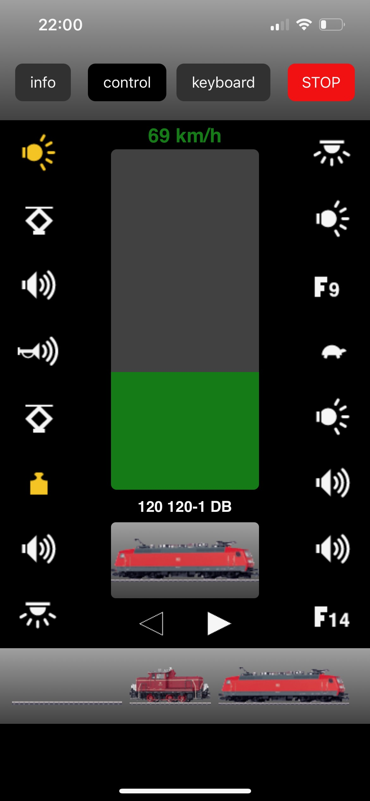
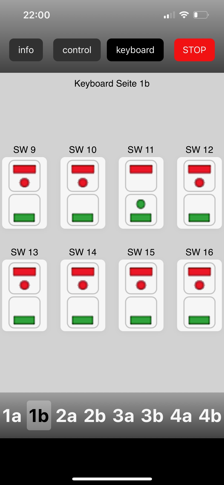

# MobileStationWebApp
Old Märklin Mobile Station App to run as an WebApp on SRSEII

## Purpose
The Märklin Mobile Station app is unfortunately no longer available in the App Store / Play Store. In addition, a web app is easier to use across different devices and operating systems than a native app. I therefore tried to recreate the look and feel, as well as the core functionality, of the Mobile Station app in a web app. This web app can now be installed and run on the SRSEII. You can open the interface in a web browser from any device without installing any additional apps. My goal was to provide the simplest possible alternative to the now-unavailable Mobile Station app.

## Limitations
The app offers more or less the same range of functions as the original app did back then. If you want more, you should use the alternatives available on the SRSEII (e.g., Railroad, Z21), or get yourself a CS3/CS3+ ;).

## Here are a few screenshots of the app:
| Control | Keyboard |
| --- | --- |
|||

## How to connect
1. Open your browser
2. Enter in the address bar: ip-address-srseii:6020
3. Open
Note: You can also “install” the website as a web app. On Apple devices, with the page open in the browser, tap the “Share” button at the bottom, then tap “Add to Home Screen.”

## Installation
todo

