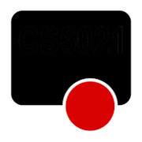
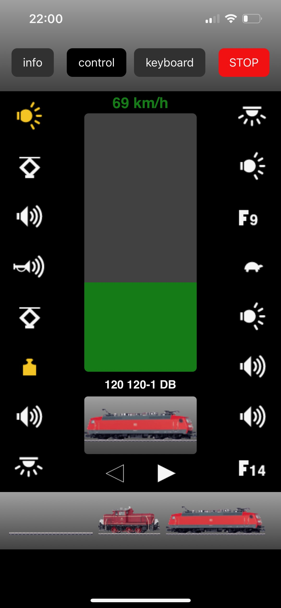

<p align="center">
    
</p>

Märklin Mobile Station inspired Web UI to control locomotives and accessories (CS2/CS3 style).
Designed to run on the SRSEII Gleisbox and general Linux/OpenWrt environments.
Provides a self-contained C++ backend (HTTP, API, SSE, UDP) and an optional Python backend for development.

Backends available:
- C++ backend: single binary (header-only HTTP server), recommended on SRSEII
- Python backend: Flask-based, useful for development and quick prototyping


## Features
- Locomotive speed, direction, and up to 32 functions
- Switch / accessory keyboard (64 slots, paged UI)
- Real-time state sync with SSE (initial snapshot + incremental updates)
- Unified control API (`/api/control_event` and `/api/keyboard_event`)
- CS2 `.cs2` file parsing for locomotives and magnet articles
- Service Worker + manifest for basic PWA behavior
- Health endpoint (`/api/health`) for monitoring / watchdogs
- Packaged `src/` layout; installable via `pyproject.toml`

### Mobile Usage: Install as WebApp
You can install the MobileStation Web App directly to your home screen for a native app-like experience:

- **iOS:** Open the app in Safari, tap the Share icon, then select "Add to Home Screen".
- **Android:** Open the app in Chrome (or most browsers), tap the menu (⋮), then choose "Install app" or "Add to Home screen".

The app includes a manifest and touch icon, so it launches fullscreen and behaves like a native app.

| Control View | Keyboard View |
| --- | --- |
|  |  |

## Quick Start (Development)
- C++ Backend (Windows): Build and run the "Debug C++ Backend" launch config in VS Code, or build with CMake tasks provided.
- C++ Backend (macOS/Linux): Configure with CMake; run resulting binary with flags below.
- Python (optional): `python -m mobile_station_webapp.server --config var --www src/frontend`

Open: `http://<host>:6020`

## Command Line Options (C++ and Python)
| Flag | Default | Description |
|------|---------|-------------|
| `--udp-ip` | `127.0.0.1` | Target CS2/bridge UDP IPv4 or hostname |
| `--config` | `var` | Base directory with `config/` (contains CS2 files and icons) |
| `--host` | `0.0.0.0` | Bind host address |
| `--port` | `6020` | HTTP listen port |
| `--www` | `src/frontend` | Frontend directory (templates/, static/, sw.js) |

## Parsing CS2 Files
The application expects a specific folder structure under the configuration directory provided via the `--config` argument (or default):

```
<config-dir>
    /config
        /lokomotive.cs2
        /magnetartikel.cs2
    /icons
        /<locomotive pictures from CS2/3>
    /fcticons
        /<function pictures from CS2/3>
    /magicons_
        /<Magnetarticle pictures from CS2/3>
```

Both cs2-files must exist in the `config` subfolder of your configuration directory. They will be imported/parsed at startup and when changes occure to them.

## OpenWrt / Embedded Deployment
- Prebuilt .ipk: download from GitHub Releases (Latest). Install and enable the init script to run on boot.
- Full guide: see `docs/INSTALL-openwrt.md`.

Init script (procd) is provided at `packaging/openwrt/init.d/mswebapp`. It prefers the C++ backend, falls back to Python if not present.

## Releases and Artifacts
- GitHub Releases: prebuilt `.ipk` artifacts are published per version (preferred).
- `packaging/`: packaging scripts and init files (do not install automatically).

Recommendation:
- Publish `.ipk` files under GitHub Releases and link from `docs/INSTALL-openwrt.md`.
- Commit the OpenWrt init script (`packaging/openwrt/init.d/mswebapp`) so users can inspect and reuse it.
- Place installation instructions under `docs/`, and link them from this README.

## Development Notes
- C++ backend in `src/backend_cpp` (single binary, header-only HTTP server)
- Optional Python backend in `src/backend_py` for development/testing
- Frontend in `src/frontend` (templates, static, sw.js)
- SSE initial snapshot + incremental updates; the frontend JS keeps the UI in sync

## Original Inspiration / Reference
Original forum walkthrough (German):
https://www.stummiforum.de/t56814f5-M-rklin-Mobile-Station-App-Schritt-f-r-Schritt.html

## License
Beerware (see header in source files).

---
Feel free to open issues or contribute enhancements (error handling, authentication, multi-user state, etc.).

---
Märklin, Trix, Gleisbox, Mobile Station, Central Station CS2, Central Station CS3, Central Station CS3+ sind Marken bzw. eingetragene Namen der Gebr. Märklin & Cie. GmbH.