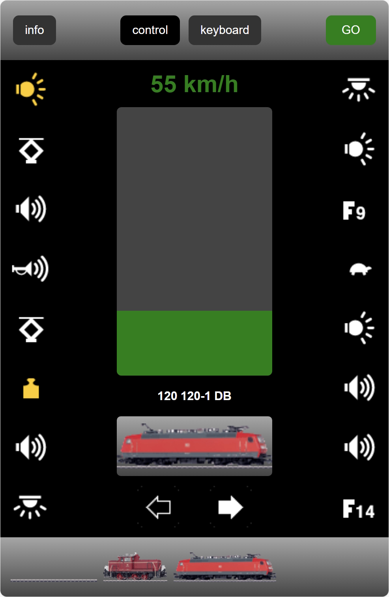

    

Märklin Mobile Station inspired Web UI to control locomotives and accessories (CS2/CS3 style).
Designed to run on the SRSEII Gleisbox and general Linux/OpenWrt environments.
Provides a self-contained C++ backend (HTTP, API, SSE, UDP) and an optional Python backend for development.

## Online Help
An Online help is available under: [Online Help](docs/index.md)
- [Getting Started](docs/help-quick-start.md)
- [FAQ](docs/help-faqe.md)

## Features
- Control Locomotive speed, direction, and up to 16 functions
- Switch / accessory keyboard (64 slots, paged UI)
- Locomotive icon selector
- Control of SRSEII's Locomotive List
- Unified control API
- CS2 `.cs2` file parsing for locomotives and magnet articles

| Control View | Keyboard View |
| --- | --- |
|  |  |

## Original Inspiration / Reference
Original forum walkthrough (German):
https://www.stummiforum.de/t56814f5-M-rklin-Mobile-Station-App-Schritt-f-r-Schritt.html

## Development Notes
The MobileStationWebApp is intended to use the C++ backend on the SRSEII. There is also an Python Backend, used for rapid development and testing of the frontend. It it not inteded to run on the SRSEII.

## License
Beerware (see header in source files).

---
Feel free to open issues or contribute enhancements (error handling, authentication, multi-user state, etc.).

---
Märklin, Trix, Gleisbox, Mobile Station, Central Station CS2, Central Station CS3, Central Station CS3+ sind Marken bzw. eingetragene Namen der Gebr. Märklin & Cie. GmbH.
