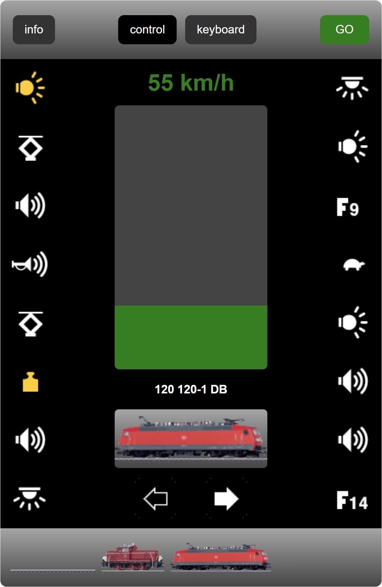
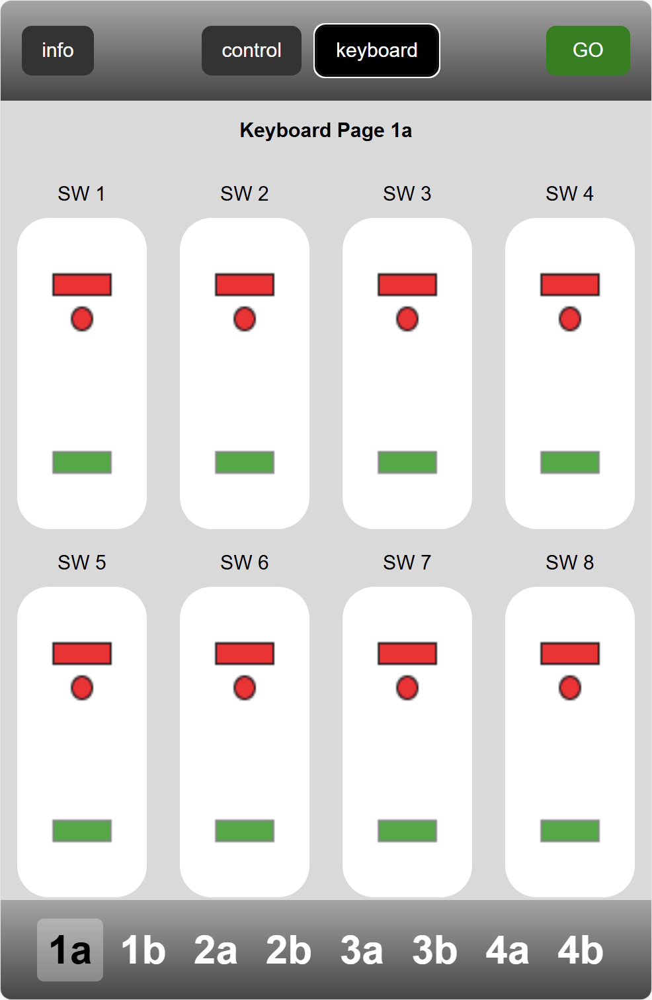
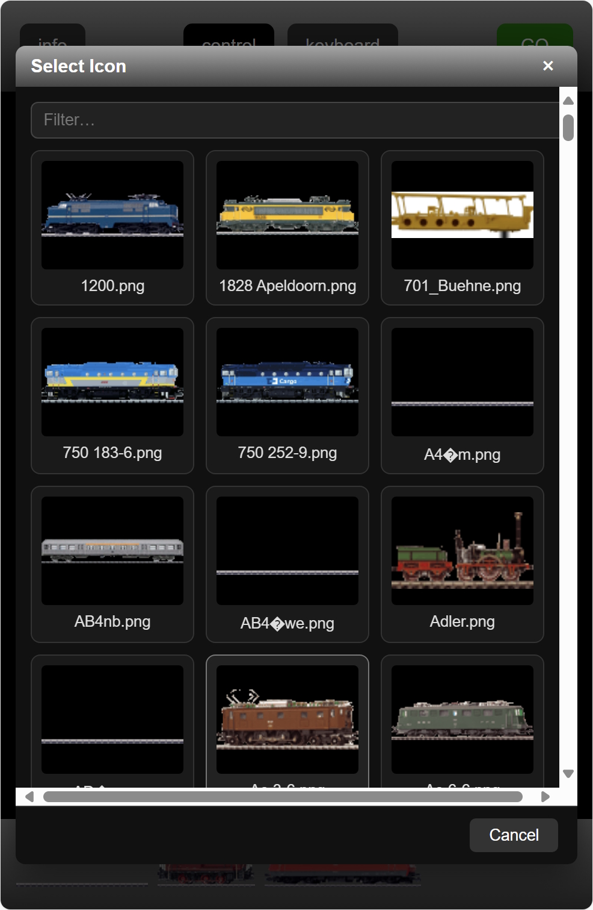
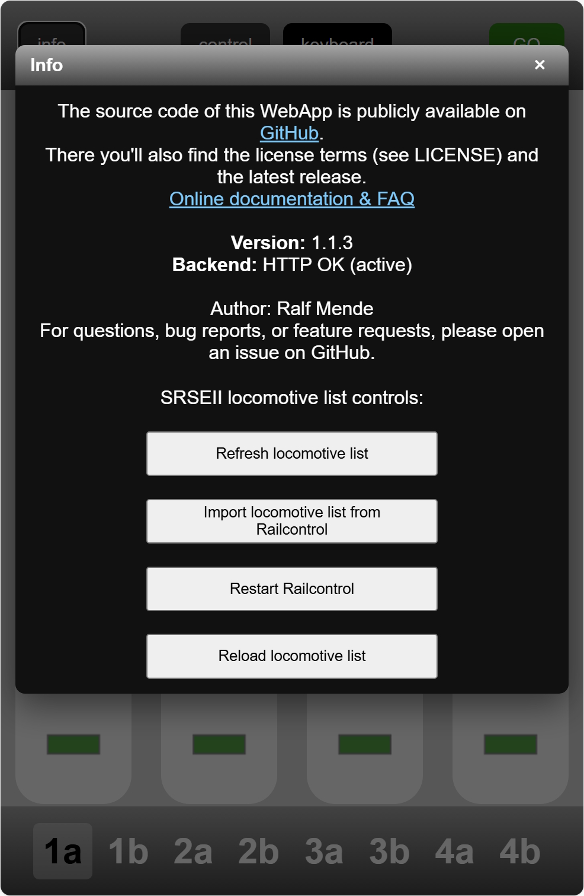

# Quick Start Guide

This guide helps you get up and running fast and shows the key parts of the UI.

## What you need

- Install MobileStationWebApp on your SRSEII
- Make sure the service is running
- Connect your phone/tablet/PC to the same network as the SRSEII (or connect directly to the SRSEII)

Once the server is running, open your browser and navigate to:

- http://gleisbox:6020 (or http://<server-ip>:6020)

## 1) Control a locomotive

The control view shows speed, direction and function buttons.

<table>
    <tr>
        <td style="width:50%; vertical-align: top; padding-right: 12px;">
            
        </td>
        <td style="width:50%; vertical-align: top;">
            <ul>
                <li>Speed: Drag the main slider to set the speed.</li>
                <li>Direction: Tap the direction button to toggle forward/reverse.</li>
                <li>Functions: Tap F0, F1, … to toggle lights, sound, etc.</li>
            </ul>
        </td>
    </tr>
</table>

## 2) Keyboard / Switches

Operate turnouts and accessories via the keyboard view.

<table>
    <tr>
        <td style="width:50%; vertical-align: top; padding-right: 12px;">
            
        </td>
        <td style="width:50%; vertical-align: top;">
            <ul>
                <li>Each tile represents a switch or accessory.</li>
                <li>Tap to toggle the state; the current state is highlighted.</li>
            </ul>
        </td>
    </tr>
    </table>

## 3) Change a locomotive icon

Change a locomotive's icon.

<table>
    <tr>
        <td style="width:50%; vertical-align: top; padding-right: 12px;">
            
        </td>
        <td style="width:50%; vertical-align: top;">
            <ul>
                <li>Click the central locomotive image to open the list of available icons.</li>
                <li>Scroll the list (or use search if available).</li>
                <li>Tap an icon to apply it.</li>
                <li>To cancel, use the upper-right or lower-right button.</li>
            </ul>
        </td>
    </tr>
</table>

## 4) System info and health

View system status and manage the SRSEII loco list.

<table>
    <tr>
        <td style="width:50%; vertical-align: top; padding-right: 12px;">
            
        </td>
        <td style="width:50%; vertical-align: top;">
            <ul>
                <li>System information: RUN/STOP state, loco/switch counts, backend version, UDP target</li>
                <li>Access Online Help</li>
                <li>Manage the SRSEII loco list (reload/update)</li>
            </ul>
        </td>
    </tr>
</table>

## Tipp: Mobile Usage: Install as WebApp
You can install the MobileStation Web App directly to your home screen for a native app-like experience:

- **iOS:** Open the app in Safari, tap the Share icon, then select "Add to Home Screen".
- **Android:** Open the app in Chrome (or most browsers), tap the menu (⋮), then choose "Install app" or "Add to Home screen".

The app includes a manifest and touch icon, so it launches fullscreen and behaves like a native app.
